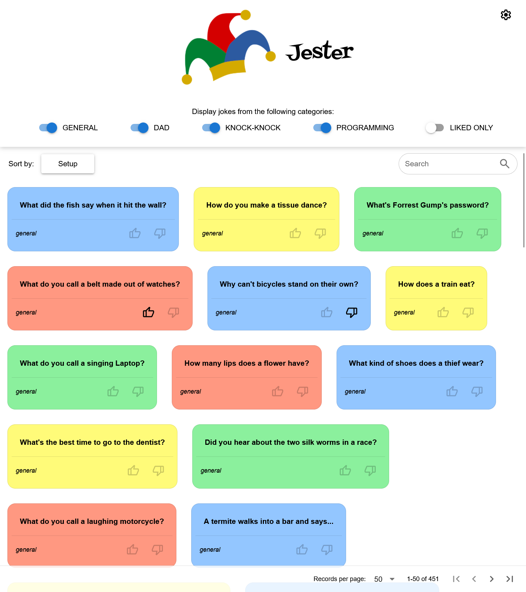

# jester

Coding exercise in Vue 3, Quasar and Vite.



## Project Setup

```sh
pnpm install
```

### Compile and Hot-Reload for Development

```sh
pnpm dev
```

### Type-Check, Compile and Minify for Production

```sh
pnpm build
```

### Run Unit Tests with Vitest

```sh
pnpm test
```

### Lint with ESLint

```sh
pnpm lint
```

## Image attribution
- Jester hat from [openclipart.org](https://openclipart.org/detail/214483/colored-jester-hat-by-dear_theophilus-214483)
- Bomb from [pixabay.com](https://pixabay.com/de/illustrations/bombe-explodieren-detonieren-1602109/)

## Implementation highlights
 - Native `fetch` calls
 - Responsive (breakpoint at 720px)
 - Quasar component library (Vite plugin)
 - Table data
   - Search and sort by setup
     - `searchString` added to model to reduce repeated `toLocaleLowerCase` calls 
   - Filter by type, liked
 - Pinia stores 
   - Automatically written to `localStorage` via `vueuse`
 - User preferences
   - Show punchline
   - Like/dislike individual jokes
   - Hide disliked
 - Simple unit testing
   - Coverage report is available with `--coverage`
 - Git `pre-push` hook (via Husky)
   - Prevents pushing with failing test(s) or packages failing security audit

## Implementation notes

### Fetch and render the API data
There's really not much "fetching" to do. The [Official Joke API](https://github.com/15Dkatz/official_joke_api/)
provides *some* API endpoints, but none that would allow the requirement to sort and filter.
Instead, it makes more sense to pull the full dataset and store in memory for
use with this app.

(It would be more efficient to just include the JSON file in the project, but then there's no example of a fetch call.)

### Provide sorting controls
There's not much to sort by. We allow the user to sort the jokes alphabetically by `setup`,
but that seems a little silly, and `punchline` even more so. The only remaining field
from the dataset is `type`, which is what has been implemented as an immutable, underlying
sort for the dataset (i.e., the jokes appear grouped by type when not sorted by `setup`).

Instead of sorting, filter toggles have been added.

### Implement pagination
The API does not provide a way to fetch a page of jokes at a time. The options are limited to individual jokes
by ID, an arbitrary number of randomly chosen jokes or an arbitrary number of jokes by type. The only API call
that could be paged is the ID option, which seems inefficient. The current implementation uses QTable's built-in
pagination over the whole dataset.

Paging was implemented before adding Quasar, and is still present, just commented-out.
